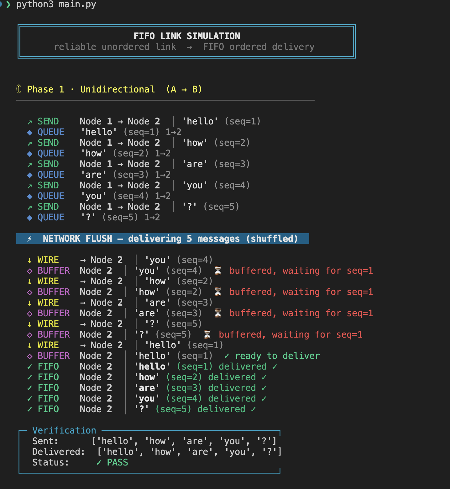

# Exercise 4 - FIFO Links over Reliable Unordered Links

> **Course**: Distributed Systems - Martin Kleppmann (University of Cambridge)  
> **Topic**: Fault Tolerance · Reliable and FIFO Links  
> **System Model**: Asynchronous crash-stop

## The Problem

Reliable network links guarantee that every sent message is eventually delivered, but they **do not guarantee ordering**. Messages can arrive in any order.

**Exercise 4** asks:

> _Give pseudocode for an algorithm that strengthens the properties of a reliable point-to-point link such that messages are received in the order they were sent (this is called a FIFO link), assuming an asynchronous crash-stop system model._

## The Algorithm

The solution is elegant in its simplicity:

### Sender Side (per receiver)

```
on init:
    sendSeq ← 0

on fifo_send(message, receiver):
    sendSeq ← sendSeq + 1
    reliable_send(⟨message, sendSeq⟩, receiver)
```

### Receiver Side (per sender)

```
on init:
    nextDeliver ← 1
    buffer ← {}

on reliable_receive(⟨message, seq⟩, sender):
    buffer[seq] ← message
    while nextDeliver ∈ buffer:
        deliver(buffer[nextDeliver])
        delete buffer[nextDeliver]
        nextDeliver ← nextDeliver + 1
```

### Why It Works

1. The sender tags each message with a **monotonically increasing sequence number**
2. The receiver maintains a **buffer** and an expected `nextDeliver` counter
3. When a message arrives out of order, it's buffered
4. When the expected sequence number arrives, the receiver delivers it **and** any consecutively buffered messages in a cascade
5. Since the underlying link is reliable (no drops), every sequence number will eventually arrive

### Properties

| Property           | Guaranteed? | How?                                                                |
| ------------------ | :---------: | ------------------------------------------------------------------- |
| **Reliability**    |     ✅      | Inherited from the underlying reliable link                         |
| **No duplication** |     ✅      | Each seq number is delivered exactly once, then removed from buffer |
| **FIFO ordering**  |     ✅      | Messages are only delivered when `nextDeliver` matches              |

## This Simulation

This project simulates the algorithm with a `Network` layer that **deliberately shuffles** messages before delivery, proving that the FIFO layer correctly reorders them.

### Architecture

```
┌─────────────────────────────────────────────────────┐
│                    Simulation                        │
│                                                     │
│  ┌──────────┐     ┌───────────┐     ┌──────────┐   │
│  │  Node A   │────▶│  Network   │────▶│  Node B   │   │
│  │           │     │           │     │           │   │
│  │ fifo_send │     │  enqueue  │     │on_receive │   │
│  │ (seq++)   │     │  shuffle  │     │  buffer   │   │
│  │           │     │  deliver  │     │  deliver  │   │
│  └──────────┘     └───────────┘     └──────────┘   │
│                                                     │
│  FIFO Layer          Reliable Link       FIFO Layer  │
│  (this exercise)     (given/simulated)  (this exercise)│
└─────────────────────────────────────────────────────┘
```

### File Structure

```
fault-tolerance-and-high-tolerance/
├── main.py        # Entry point - runs 3 simulation phases
├── message.py     # Message dataclass (payload, seq, sender, receiver)
├── network.py     # Reliable unordered link (shuffles on flush)
├── node.py        # FIFO algorithm (seq numbering + buffer + ordered delivery)
├── visuals.py     # Terminal output - ANSI colors, box-drawing, event logging
└── README.md      # ← You are here
```

| File                         | Role                                                                               |
| ---------------------------- | ---------------------------------------------------------------------------------- |
| [`message.py`](./message.py) | Pure data - the `Message` dataclass                                                |
| [`network.py`](./network.py) | Simulates a reliable link that **reorders** messages (`random.shuffle`)            |
| [`node.py`](./node.py)       | The heart of the exercise - implements sender seq numbering and receiver buffering |
| [`visuals.py`](./visuals.py) | Pretty terminal output with ANSI colors and box-drawing characters                 |
| [`main.py`](./main.py)       | Orchestrates 3 test phases and verifies FIFO correctness                           |

## Running

```bash
python3 main.py
```

No external dependencies - uses only Python standard library.

## Simulation Phases

### Phase 1 - Unidirectional (A → B)

Node A sends 5 messages: `["hello", "how", "are", "you", "?"]`. The network shuffles them. The FIFO layer on Node B buffers out-of-order messages and delivers all 5 in the correct order once the missing sequence numbers arrive.

**Key observation**: When `hello` (seq=1) arrives last from the network, the buffer cascades and delivers all 5 messages instantly in order.

### Phase 2 - Bidirectional (A ↔ B)

Both nodes send to each other simultaneously. Each node maintains **independent per-peer** sequence counters and buffers, so A→B and B→A orderings are maintained separately without interfering.

### Phase 3 - Multiple Flushes (Persistent State)

Messages are sent across multiple network flushes. Sequence numbers continue from where they left off (seq=8, 9, 10, 11...), proving the FIFO guarantee holds across separate delivery rounds - the state is persistent, not per-batch.

## Sample Output

<p align="center">
  
</p>

```
╔══════════════════════════════════════════════════════════════╗
║                     FIFO LINK SIMULATION                     ║
║      reliable unordered link  →  FIFO ordered delivery       ║
╚══════════════════════════════════════════════════════════════╝

① Phase 1 · Unidirectional  (A → B)
────────────────────────────────────────────────────────

  ↗ SEND    Node 1 → Node 2  │ 'hello' (seq=1)
  ↗ SEND    Node 1 → Node 2  │ 'how'   (seq=2)
  ↗ SEND    Node 1 → Node 2  │ 'are'   (seq=3)
  ...

  ⚡ NETWORK FLUSH - delivering 5 messages (shuffled)

  ↓ WIRE    → Node 2  │ 'you'   (seq=4)
  ◇ BUFFER  Node 2    │ 'you'   (seq=4)  ⏳ buffered, waiting for seq=1
  ↓ WIRE    → Node 2  │ 'hello' (seq=1)
  ◇ BUFFER  Node 2    │ 'hello' (seq=1)  ✓ ready to deliver
  ✓ FIFO    Node 2    │ 'hello' (seq=1) delivered ✓
  ✓ FIFO    Node 2    │ 'how'   (seq=2) delivered ✓
  ✓ FIFO    Node 2    │ 'are'   (seq=3) delivered ✓
  ✓ FIFO    Node 2    │ 'you'   (seq=4) delivered ✓
  ✓ FIFO    Node 2    │ '?'     (seq=5) delivered ✓

  ┌─ Verification ────────────────────────────────┐
  │  Sent:      ['hello', 'how', 'are', 'you', '?']
  │  Delivered:  ['hello', 'how', 'are', 'you', '?']
  │  Status:     ✓ PASS
  └───────────────────────────────────────────────┘
```

## Key Takeaways

1. **Sequence numbers are per-peer**, not global. Node A maintains a separate counter for each node it sends to.
2. **Buffering is the tradeoff** - the receiver may need to hold arbitrarily many messages in memory if the network reorders heavily. In a crash-stop model, a crashed node simply stops delivering (buffered messages are lost).
3. **The underlying link must be reliable** - if messages could be dropped, the receiver would wait forever for a missing sequence number. Handling drops requires retransmission (a separate concern).
4. **This is a building block** - FIFO links are used as a foundation for stronger guarantees like causal broadcast and total order broadcast.

## References

- Martin Kleppmann, _Distributed Systems_, Lecture 3: Fault Tolerance
- [Lecture Notes (PDF)](https://www.cl.cam.ac.uk/teaching/2122/ConcDisSys/dist-sys-notes.pdf)
- [Video Lectures (YouTube)](https://www.youtube.com/playlist?list=PLeKd45zvjcDFUEv_ohr_HdUFe97RItdiB)
