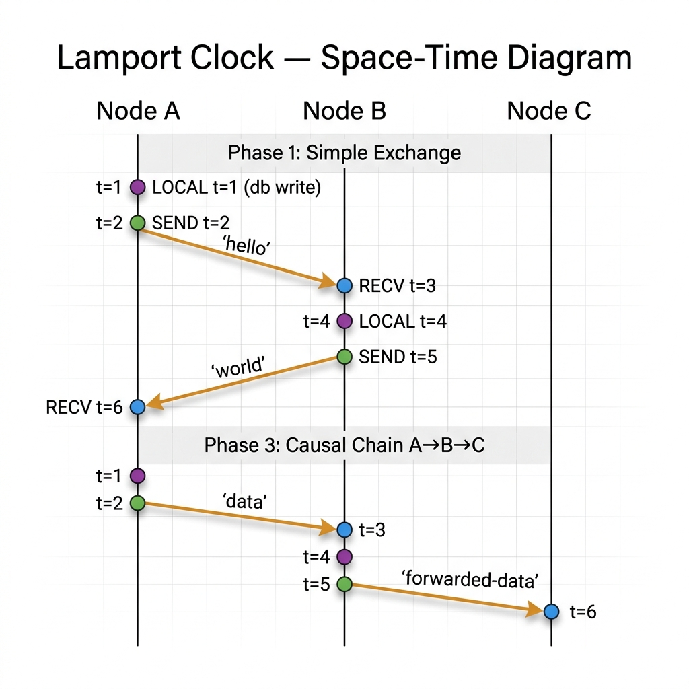

# Exercise - Lamport Clocks

> **Course**: Distributed Systems - Martin Kleppmann (University of Cambridge)  
> **Topic**: Broadcast Protocols and Logical Time  
> **Chapter**: 4 - Logical Time

## The Problem

In a distributed system there is no shared global clock. Physical clocks on different machines drift and cannot be perfectly synchronised. We need a **logical clock** that captures the *causal ordering* of events without relying on physical time.

**Lamport clocks** (Leslie Lamport, 1978) provide a simple mechanism:

> If event *a* causally precedes event *b* (written `a → b`), then `T(a) < T(b)`.

## The Algorithm

### Rules

```
on init:
    t ← 0

on local event:
    t ← t + 1

on send(message):
    t ← t + 1
    send ⟨message, t⟩

on receive(⟨message, t_msg⟩):
    t ← max(t, t_msg) + 1
```

### Why It Works

1. Every event (local, send, or receive) increments the clock, so timestamps strictly increase on each node.
2. When a message is received, `max(t, t_msg) + 1` ensures the receiver's clock jumps ahead of both its own clock *and* the sender's timestamp.
3. This guarantees: if `a → b` then `T(a) < T(b)`.

### Key Limitation

The converse does **not** hold:

> `T(a) < T(b)` does **NOT** imply `a → b`.

Two independent events on different nodes may happen to get ordered timestamps purely by coincidence. Lamport clocks **cannot distinguish causal ordering from concurrency**. This motivates **vector clocks** (Exercise 02).

### Properties

| Property                         | Guaranteed? | Notes                                                        |
| -------------------------------- | :---------: | ------------------------------------------------------------ |
| `a → b ⟹ T(a) < T(b)`          |     ✅      | Core guarantee                                               |
| `T(a) < T(b) ⟹ a → b`          |     ❌      | False - concurrent events can have ordered timestamps        |
| Concurrency detection            |     ❌      | Cannot determine if two events are concurrent                |
| Compact representation           |     ✅      | Single integer per message - very lightweight                |

## This Simulation

### Space-Time Diagram

<p align="center">
  
</p>

### Architecture

```
┌─────────────────────────────────────────────────────┐
│                  Simulation                          │
│                                                     │
│  ┌──────────┐     ┌───────────┐     ┌──────────┐   │
│  │  Node A   │────▶│  Network   │────▶│  Node B   │   │
│  │           │     │           │     │           │   │
│  │ t++ local │     │  enqueue  │     │ max+1    │   │
│  │ t++ send  │     │  shuffle  │     │ on recv  │   │
│  │ max+1 recv│     │  deliver  │     │          │   │
│  └──────────┘     └───────────┘     └──────────┘   │
│                                                     │
│  Lamport Clock     Reliable Link      Lamport Clock  │
└─────────────────────────────────────────────────────┘
```

### File Structure

```
01-lamport-clocks/
├── main.py        # Entry point - runs 4 simulation phases
├── message.py     # Message dataclass (payload, sender, receiver, timestamp)
├── network.py     # Reliable unordered link (shuffles on flush)
├── node.py        # Lamport clock algorithm (local/send/receive rules)
├── visuals.py     # Terminal output - ANSI colors, timelines, verification
└── README.md      # ← You are here
```

| File                         | Role                                                                      |
| ---------------------------- | ------------------------------------------------------------------------- |
| [`message.py`](./message.py) | Pure data - `Message` dataclass with Lamport timestamp                    |
| [`network.py`](./network.py) | Simulates a reliable link that **reorders** messages (`random.shuffle`)   |
| [`node.py`](./node.py)       | The heart of the exercise - Lamport clock rules: `t++`, `max(t,msg)+1`  |
| [`visuals.py`](./visuals.py) | Pretty terminal output with ANSI colors and event timelines               |
| [`main.py`](./main.py)       | Orchestrates 4 phases and verifies clock invariants                       |

## Running

```bash
python3 main.py
```

No external dependencies - uses only Python standard library.

## Simulation Phases

### Phase 1 - Simple Exchange (A ↔ B)

Node A does a local event, sends to B. Node B receives, does a local event, sends back. Verifies that `T(send) < T(receive)` holds for both messages.

### Phase 2 - Concurrent Sends (A ↔ B)

Both nodes send messages before either receives anything. Despite the concurrency, the `T(send) < T(receive)` invariant still holds for each individual message.

### Phase 3 - Causal Chain (A → B → C)

A sends to B, B processes and forwards to C. Verifies transitivity: `T(A_send) < T(B_recv) < T(B_send) < T(C_recv)`.

### Phase 4 - Limitation Demo

Two nodes perform independent local events with no communication. Lamport clocks assign ordered timestamps (`T=2 > T=1`) even though the events are **concurrent**. This demonstrates the fundamental limitation and motivates vector clocks.

## Key Takeaways

1. **Lamport clocks are lightweight** - just a single integer per event, one integer piggybacked on each message.
2. **They capture causality in one direction** - if `a → b` then `T(a) < T(b)`, guaranteed.
3. **They cannot detect concurrency** - `T(a) < T(b)` might be coincidental, not causal. You need **vector clocks** to distinguish "happened-before" from "concurrent".
4. **The `max` rule is critical** - without it, a receiver's clock could fall behind the sender's, breaking the causality guarantee.

## References

- Leslie Lamport, "Time, Clocks, and the Ordering of Events in a Distributed System" (1978)
- Martin Kleppmann, _Distributed Systems_, Lecture 4: Logical Time
- [Lecture Notes (PDF)](https://www.cl.cam.ac.uk/teaching/2122/ConcDisSys/dist-sys-notes.pdf)
- [Video Lectures (YouTube)](https://www.youtube.com/playlist?list=PLeKd45zvjcDFUEv_ohr_HdUFe97RItdiB)
